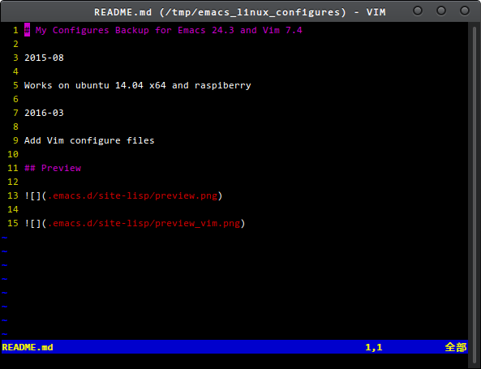

# My Configures Backup for Emacs 25.0 and Vim 7.4

Compile or update your Emacs 25.0 to enjoy the lastest features.

Do not install it via APT source for the reason that the emacs-version is out of date!

[How to compile Emacs](http://lixingcong.github.io/2016/04/19/compile-emacs-on-linux/)

[GNU Emacs source code](https://github.com/emacs-mirror/emacs)

 

 

 
