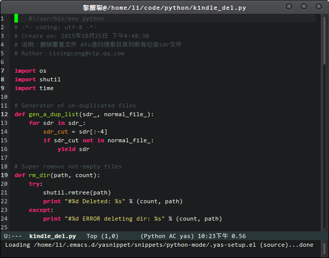

# My Configures Backup for Emacs 24.5 and Vim 7.4

Compile or update your Emacs 24.5 to enjoy the lastest features.

Do not install it via APT source for the reason that the emcas-version is out of date!

[How to compile Emacs](http://lixingcong.github.io/2016/04/19/compile-emacs-on-linux/)

[GNU Emacs source code](http://ftp.gnu.org/gnu/emacs/)

 

 

 
